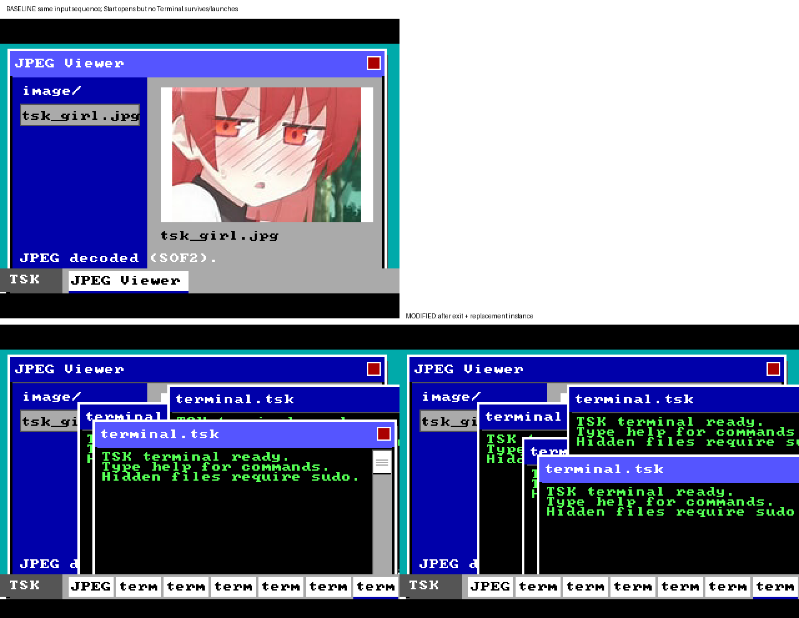

# Project Tsuki OS


## 文档导航

- [更新日志](CHANGELOG.md)：版本变化、修复和验证记录。
- [TLX 兼容层](TLX.md)：文件、目录和进程兼容接口。
- [TSK 应用开发指南](docs/TSK_DEVELOPMENT.md)：从最小应用到构建、打包、多实例与调试。
- [工程结构](PROJECT_STRUCTURE.md)：源码目录和模块说明。

## 多窗口与性能



当前窗口系统支持同一 TSK 的多个独立实例。每个实例保持原链接虚拟地址，同时使用独立页目录和私有物理镜像槽，避免重复启动覆盖仍在运行的代码与全局数据。

- 开始菜单默认创建新实例；普通 `launch_tsk()` 仍会聚焦已有实例。
- 终端可使用 `run --new <name.tsk>` 显式创建新实例。
- 窗口缓冲按实际尺寸分页分配，渲染器通过引用快照处理并发关闭。
- 脏矩形、局部 framebuffer 提交、批量 RGB blit 与空闲 `hlt` 减少无效绘制和忙轮询。
- 已在 QEMU 中验证 6 个 Terminal 并行运行、退出一个实例后重新创建，期间无页故障或坏上下文。

## 系统要求

- Linux/Unix 环境
- `nasm`
- `gcc`、`ld`，或可用的 `i686-linux-gnu-` 交叉工具链
- `qemu-system-i386`

如果系统中存在 `i686-linux-gnu-gcc`，Makefile 会自动使用对应的交叉工具链；也可以手动指定：

```bash
make CROSS=i686-linux-gnu-
```

## 构建和运行

```bash
# 编译并生成 OS 镜像
make

# 在 QEMU 中运行
make run

# 在终端显示 COM1 串口日志
make debug

# 清理构建产物
make clean
```

构建完成后，主要产物位于 `build/`：

- `build/boot.bin`：启动扇区
- `build/kernel.bin`：内核二进制
- `build/kernel.elf`：内核 ELF 文件
- `build/*.tsk`：应用程序任务文件
- `build/os-image.img`：完整 OS 镜像
- `build/qemu.log`：运行时中断和异常日志
